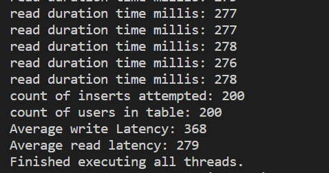

# Using Cosmos retry and load balancing policies in the Azure Cosmos DB API for Cassandra (v4 Driver)
Azure Cosmos DB is a globally distributed multi-model database. One of the supported APIs is the Cassandra API. This sample illustrates how to handle rate limited requests, and use a load balancing policy to specify preferred read or write regions. These are also known as [429 errors](https://docs.microsoft.com/rest/api/cosmos-db/http-status-codes-for-cosmosdb), and are returned when the consumed throughput exceeds the number of [Request Units](https://docs.microsoft.com/azure/cosmos-db/request-units) that have been provisioned for the service. In this code sample, we implement the [Azure Cosmos DB extension for Cassandra API for V4](https://github.com/Azure/azure-cosmos-cassandra-extensions/tree/feature/java-driver-4/improved-concurrency-and-test-coverage). The extension JAR is built using [jitpack.io](https://jitpack.io) from the latest stable release branch in github, and is offered as a public preview. 

The retry policy handles errors such as OverLoadedException (which may occur due to rate limiting), and uses an exponential growing back-off scheme for retries. The time between retries is increased by a growing back off time (default: 1000 ms) on each retry, unless maxRetryCount is -1, in which case it backs off with a fixed duration. It is important to handle rate limiting in Azure Cosmos DB to prevent errors when [provisioned throughput](https://docs.microsoft.com/azure/cosmos-db/how-to-provision-container-throughput) has been exhausted. 

## Prerequisites
* Before you can run this sample, you must have the following prerequisites:
    * An active Azure Cassandra API account - If you don't have an account, refer to the [Create Cassandra API account](https://aka.ms/cassapijavaqs). For illustration purposes, the sample assumes an account with two regions that are very far apart: in this case Australia East and UK South (where UK South is very close to where the client application has been deployed). 
    * [Java Development Kit (JDK) 1.8+](http://www.oracle.com/technetwork/java/javase/downloads/jdk8-downloads-2133151.html)
        * On Ubuntu, run `apt-get install default-jdk` to install the JDK.
    * Be sure to set the JAVA_HOME environment variable to point to the folder where the JDK is installed.
    * [Download](http://maven.apache.org/download.cgi) and [install](http://maven.apache.org/install.html) a [Maven](http://maven.apache.org/) binary archive
        * On Ubuntu, you can run `apt-get install maven` to install Maven.
    * [Git](https://www.git-scm.com/)
        * On Ubuntu, you can run `sudo apt-get install git` to install Git.

## Running this sample
1. Clone this repository using `git clone git@github.com:Azure-Samples/azure-cosmos-cassandra-extensions-java-sample-v4.git cosmosdb`.

1. Change directories to the repo using `cd cosmosdb/java-examples`

1. Next, substitute the Cassandra host, username, and password in  `java-examples\src\test\resources\config.properties` (you can get all these values from "connection string" tab in Azure portal) Your config file should look like the below:

    ```conf
    ###Cassandra endpoint details on cosmosdb
    cassandra_port=10350
    contactPoint=cassandrahost.cassandra.cosmos.azure.com
    cassandra_username=cassandrahost
    cassandra_password=********
    #ssl_keystore_file_path=<FILLME>
    #ssl_keystore_password=<FILLME>     
    ```

    If ssl_keystore_file_path is not given in config.properties, then by default <JAVA_HOME>/jre/lib/security/cacerts will be used. If ssl_keystore_password is not given in config.properties, then the default password 'changeit' will be used

1. Now take a look at the file `java-examples\src\test\resources\application.conf`. This contains various connection settings that are recommended for Cosmos DB Cassandra API, as well as implementing the retry and load balancing policies in the extension library. You will also notice a preferred write region and read region have been defined. For illustration in this sample, the account is initially created in UK South (which becomes the write region), and then Australia East is chosen as an additional read region, where UK South is very close to the client code. You can choose any two regions with a similar distance between them, where the client is deployed very close to the write region.

    ```conf
          # Datacenter for read operations
          read-datacenter = "Australia East"
          # Datacenter for write operations
          write-datacenter = "UK South"
    ``` 

   

1. Run `mvn clean install` from java-examples folder to build the project. This will generate cosmosdb-cassandra-examples.jar under target folder.
 
1. Run `java -cp target/cosmosdb-cassandra-examples.jar com.microsoft.azure.cosmosdb.cassandra.examples.UserProfile` in a terminal to start your java application. This will create a keyspace and user table, and then run a load test with many concurrent threads attempting to force rate limiting (429) errors in the database. The test will also collect the ids of all reads and then read back all records sequentially, measuring the latency. The output will include a report of the average latencies for both reads and writes at the end. The "users in table" and "inserts attempted" should be identical since rate limits have been successfully handled and retried. Notice that although requests are all successful, you may see significant "average latency" of writes due to requests being retried after rate limiting. You should also see a high latency for reads as the read region (in this case Australia East) is much further away.

   

    If you do not see higher latencies for writes, you can increase the number of threads in UserProfile.java in order to force more rate limiting: 

    ```java
        public static final int NUMBER_OF_THREADS = 40;
    ```

1. To improve the read latency for our UK South client application instance, we can change the `read-datacenter` parameter (implemented by the load balancing policy in the extension) within `application.conf` to make sure that reads are served from the region local to the application. Of course, for the application instance that is running in Australia East, the settings would stay as Australia East, to ensure that each client is communicating with the closest region:

    ```conf
          # Datacenter for read operations
          read-datacenter = "UK South"
          # Datacenter for write operations
          write-datacenter = "UK South"
    ```

1. Run the application again and you should observe lower read latencies.

   

1. Now we can improve on the write latencies in one of two ways. Of course, we can increase the provisioned throughput so that rate limiting is not faced. One alternative to increasing RU provisioning for mitigating rate limiting, which might be more useful in scenarios where there is a highly asymmetrical distribution of consumed throughput between regions (i.e. you have many more reads/writes in one region than others), is to load balance between different regions from the client (an approach which is not allowed by the default load balancing policy, but we provide in our custom policy). Depending on the distance between regions, there is some cost trade off between the latency incurred when routing to a further away region (in order to lower cost of RU provisioning by leveraging under-used regions) and keeping latency down to an absolute minimum by always routing to the nearest region, and ensuring that RUs are provisioned at a level which always accounts for the region that has the highest activity. This is a trade-off that you will need to decide upon within your business. We can simulate client-side load balancing in this sample, by setting the `loadBalanceRegions` variable to true in `java -cp target/cosmosdb-cassandra-examples.jar com.microsoft.azure.cosmosdb.cassandra.examples.UserProfile`:

    ```java
    Boolean loadBalanceRegions = true;
    ```
    Note: to observe any difference when running this, you would need to have two regions configured for replication, and [multi-master writes configured](https://docs.microsoft.com/en-us/azure/cosmos-db/how-to-multi-master). When you run the test again with load loadBalanceRegions set to true, you should see requests being written to different regions, with latencies reduced, without having to increase provisioned throughput (RUs):

    

    Note: you may notice that if you are not experiencing rate limiting even when load balancing is set to false in this sample, then the average latency if load balancing is set to true might be higher. There is because there is a cost trade off between the latency incurred when routing to a further away region (in order to lower cost of RU provisioning by leveraging under-used regions) and keeping latency down to an absolute minimum by always routing to the nearest region, and ensuring that RUs are provisioned at a level which always accounts for the region that has the highest activity. This is trade-off that you will need to decide upon within your business.  
    
    Also bear in mind that when writing data to Cassandra, you should ensure that you account for [query idempotence](https://docs.datastax.com/en/developer/java-driver/3.0/manual/idempotence/), and the relevant rules for [retries](https://docs.datastax.com/en/developer/java-driver/3.0/manual/retries/#retries-and-idempotence). You should always perform sufficient load testing to ensure that the implementation meets your requirements.

## About the code
The code included in this sample is a load test to simulate a scenario where Cosmos DB will rate limit requests (return a 429 error) because there are too many requests for the [provisioned throughput](https://docs.microsoft.com/azure/cosmos-db/how-to-provision-container-throughput) in the service. In this sample, we create a Keyspace and table, and run a multi-threaded process that will insert users concurrently into the user table. To help generate random data for users, we use a java library called "javafaker", which is included in the build dependencies. The loadTest() will eventually exhaust the provisioned Keyspace RU allocation (default is 400RUs). We also provide a client side load balancing test. 


## Review the code

You can review the following files: `src/test/java/com/microsoft/azure/cosmosdb/cassandra/util/CassandraUtils.java` and `src/test/java/com/microsoft/azure/cosmosdb/cassandra/repository/UserRepository.java` to understand how the sessions are created. You should also review the main class file  `src/test/java/com/microsoft/azure/cosmosdb/cassandra/examples/UserProfile.java` where the load test is created and run. The parameters (maxRetryCount, growingBackOffTimeMillis, fixedBackOffTimeMillis) for retry policy are defined within `src/test/resources/application.conf`

## More information

- [Azure Cosmos DB](https://docs.microsoft.com/azure/cosmos-db/introduction)
- [Java driver Source](https://github.com/datastax/java-driver)
- [Java driver Documentation](https://docs.datastax.com/en/developer/java-driver/)
